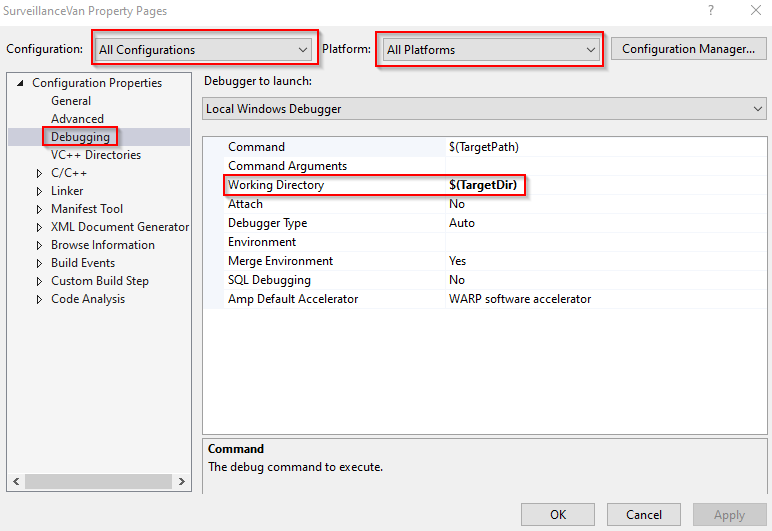

# anno1800-scripting-api

## Disclaimer

This is a pet/passion/hobby project!

No guarantees and no promises.

I never coded anything of this kind before, so expect some limitations :P

**Also this might count as cheating, so be careful!**

Finally, if you look through the code you will notice that many places
are quite messy. Since I've never done this before and the game changes
I cannot tell if certain techniques work or not. Much of the code could
use a caring hand...

I would however love any feedback on any aspect of the code!

## Description

The idea of the project is to implement a scripting interface with [Anno 1800][1].
The game itself allows users to control most things through UI and in addition,
shipping of goods via trade routes. The goal of this project is to expose as
much functionality of the game through a C# scripting API.

## How it works

There are three components to the scripting interface. There is first a DLL
`TomCruise` which is injected into the game process.

The DLL does the most of the important work. The DLL finds code and hooks into
it. The DLL has a socket connection to the `SurveillanceVan`. The
`SurveillanceVan` is a process running outside of the game and serves as a
middle man for the API and the code running inside the game.

The C# code offers functions that talks to the `SurveillanceVan` process.
In doing so, the C# code is a high level accessor to the injected code.

## Requirements

    * Visual Studio 2019 (C++ and C#)

## How to install and use

I will probably change a lot when I'm happier with the code. But at current,
following _should_ work.

  * Clone the repo to a local folder
  * Build the `BigHeist.sln` solution file (in debug mode)
  * Run Anno 1800
  * Configure the debugging settings by specifying `$(TargetDir)` as the working directory, as can be seen in the following image 
  * Launch the solution (still in debug mode)
  * Run code using the monocle project

## Example

[1]:https://www.ubisoft.com/en-us/game/anno-1800/

